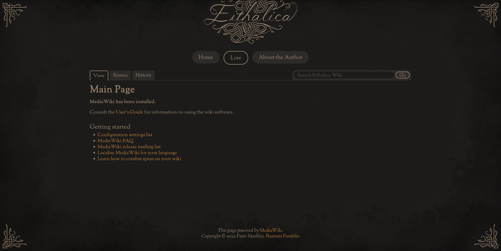

# MediaWiki skin for Eithalica Wiki

This skin is designed for use on [Eithalica.world](https://eithalica.world). The wiki part of this site is meant to feel like a cohesive whole with the non-wiki parts, which influenced a lot of my technical choices.

## Custom Top-Level Menu

I wrote my own top-level menu in a JSON file, using this format. I recommend that you do the same, because the skin will probably (?) look a bit wrong without it:

	[
		{
			"id": "home",
			"name": "Home",
			"href": "/"
		},
		{
			"id": "lore",
			"name": "Lore",
			"href": "/lore/"
		},
		{
			"id": "author",
			"name": "About the Author",
			"href": "/author/"
		}
	]

I then retrieved that JSON from inside `LocalSettings.php` and wrote the contents to a new key inside the Wiki menu data:

	$wgHooks['SkinTemplateNavigation::Universal'][] = function ( $template, &$links ) {
		$menu = json_decode(file_get_contents(dirname(dirname(dirname(__DIR__)))."/conf/menu.json"));
		for ($i=0; $i < count($menu); $i++) {
			if ($menu[$i]->show) {
				$links['custom'][$menu[$i]->id] = [
					'class' => ($menu[$i]->id == "wiki" ? 'active' : ''),
					'href' => $menu[$i]->href,
					'text' => $menu[$i]->name
				];
			}
		}
	};

The skin template knows to look for and display this `custom` key inside the menu data.

> [!Note]
> You will need to edit this line depending on your directory structure:
> 
> `$menu = json_decode(file_get_contents(dirname(dirname(dirname(__DIR__)))."/conf/menu.json"));`
> 
> (Each call to `dirname()` moves upward by one level in the directory structure from the location of your MediaWiki `index.php` script, similar to `../` in UNIX path notation.)

## Dark or Light Mode?

This skin requires you to specify either dark mode or light mode, by applying the `dark-mode` or `light-mode` class to the `body` element. To do this, add the following code to your `LocalSettings.php` file:

	# Courtesy of Samwilson from MediaWiki: https://www.mediawiki.org/w/index.php?title=Topic:V2tzn1fwy6lwa6m6&topic_showPostId=v2ulvjo1d1v4h608#flow-post-v2ulvjo1d1v4h608
	$wgHooks['OutputPageBodyAttributes'][] = function ( OutputPage $out, Skin $skin, &$bodyAttrs ) {
	  $bodyAttrs['class'] .= ' dark-mode'; // Note the leading space character.
	};

(If you want light mode, replace `dark-mode` in the above code with `light-mode`.)

## Disable Login?

As stated above, this skin was designed for a particular commercial website in mind. On that website, all content is considered read-only. User editing and login are both disabled.

I list here some general configuration steps, but please note the section below about the [`nologin` Body Class](#nologin-body-class) which is specific to this skin.

### Disable Article Editing and User Signup

Disabling login is pointless if you still allow anonymous article editing.

If you didn't choose "Authorized editors only" in [the installer script](https://www.mediawiki.org/wiki/Manual:Config_script), you can add this to `LocalSettings.php`:

	//disable article editing and user signup
	$wgGroupPermissions['*']['createaccount'] = false;
	$wgGroupPermissions['*']['edit'] = false;

Users who access the `?title=<page_title>&action=edit` or `?title=Special:CreateAccount` URLs will now be greeted with permission block messages.

### How to Disable Login

To disable login, I added this to `LocalSettings.php`:

	//disable login, courtesy of Avinash: https://xpertdeveloper.com/disable-login-logout-in-mediawiki/
	$wgHooks['SpecialPage_initList'][] = function (&$list) {
		unset( $list['Userlogin'] );
	};
	$wgHooks['PersonalUrls'][] = function (&$personal_urls, &$wgTitle) {
		unset( $personal_urls["login"] );
		unset( $personal_urls['anonlogin'] );
	};

This will suppress the login link as well as disable the login function even for those who directly access the `?title=Special:UserLogin` URL.

### `nologin` Body Class

If you disable the login links, in addition to a `dark-mode` or `light-mode` class I recommend that you also add the `nologin` class the the `<body>` element. This will prevent style glitches caused by empty `<ul>` menu elements meant for authenticated users (which are not so easily suppressed as the `<li>` list items inside them).

You can use the same method [as above](#dark-or-light-mode), but with the added class:

	$bodyAttrs['class'] .= ' dark-mode nologin'; // Note the leading space character.

## Footer Text

This skin was designed for a sleek, one- or two-line text footer at the most. Most of the default footer links are redundant with [the custom site-wide menu](#custom-top-level-menu) anyway.

Write your own license or copyright notice like so in `LocalSettings.php`:

	$wgHooks['SkinAddFooterLinks'][] = function ( Skin $skin, string $key, array &$footerlinks ) {
		if ( $key === 'places' ) {
			$footerlinks['copyright'] = Html::rawElement( 'p',
				[
					'id' => 'copyright'
				],
				"This page powered by <a href=\"https://www.mediawiki.org/\">MediaWiki</a>. Copyright &copy; ".date("Y")." Peter Markley. <a href=\"https://petermarkley.com\">Business Portfolio</a>"
			);
		};
	};

You can remove the remaining footer links by accessing the associated `?title=MediaWiki:<link_name>` URL and saving an empty page at that location:
- `?title=MediaWiki:Privacy`
- `?title=MediaWiki:Aboutsite`
- `?title=MediaWiki:Disclaimers`

> [!Tip]
> To my disappointment, this is a special technique that worked only with these footer links and did not necessarily apply to links elsewhere on the page.
